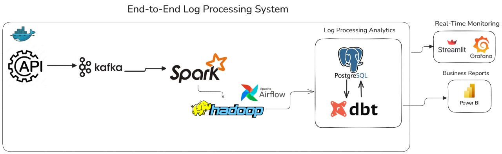
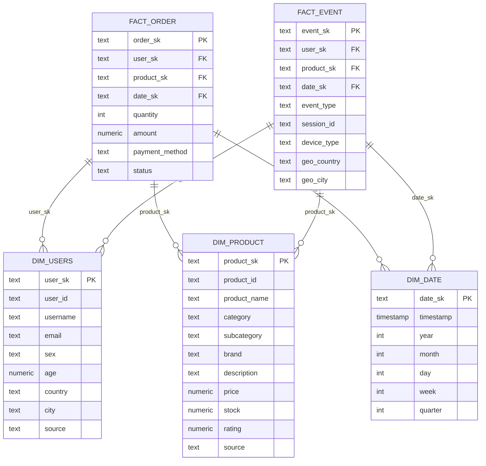

# End-to-End Log Processing System
## Overview
This project is an end-to-end big data pipeline for processing, storing, and analyzing e-commerce event logs. It leverages modern data engineering tools and technologies, including:

- **Kafka** for real-time event streaming
- **Spark Structured Streaming** for real-time data processing
- **HDFS** for distributed storage
- **PostgreSQL** for analytics-ready storage
- **dbt** for data transformation and modeling
- **Airflow** for workflow orchestration (including batch jobs)
- **Docker Compose** for easy multi-service orchestration
- **Streamlit** for real-time monitoring and visualization
- **Power BI** for business intelligence and visualization

## Pipeline Architecture
 

## Data Flow

1. **Producer** generates logs and sends them to Kafka topic `LogEvents`.
2. **Consumer** reads from Kafka, parses and flattens the data, writes raw logs to HDFS.
3. **Streamlit** provides real-time monitoring and visualization of the streaming data.
4. **Airflow** runs a batch job every 10 minutes to move new data from HDFS to PostgreSQL.
5. **dbt** transforms and models the data in PostgreSQL.
6. **Power BI** connects to PostgreSQL for analytics and visualization.

## Monitoring & Analytics Features

### Real-Time Monitoring
- **Event Count Tracking**: Monitor events by type, user, and geographic location
- **Performance Metrics**: Track processing latency and throughput
- **Error Monitoring**: Real-time alerting for system issues
- **Geographic Visualization**: World map showing user activity by country

### Statistical Analytics
- **User Behavior Analysis**: Session duration, product interactions
- **Revenue Tracking**: Purchase amounts, payment methods
- **Search Analytics**: Query patterns, result counts
- **Error Analysis**: Error codes, failure rates

### Dashboard Features
- **Real-time Updates**: Live data refresh every few seconds
- **Interactive Filters**: Drill-down capabilities by time, region, event type
- **Customizable Alerts**: Configure thresholds for automated notifications
- **Export Capabilities**: Download reports and data for further analysis

##  Pipeline Overview

This data pipeline consists of **three main task groups**, orchestrated using Apache Airflow:

### 1.  `check_services_group`
- **Purpose**: Verifies that all critical services (e.g., PostgreSQL, Spark) are running and healthy.
- **Task**: `check_services_health` (PythonOperator)

### 2.  `validate_and_processing_group`
- **Purpose**: Validates raw data from PostgreSQL and processes it using Spark.
- **Tasks**:
  - `validate_postgres_data` (PythonOperator)
  - `spark_batch_task` (BashOperator)

### 3.  `dbt_group`
- **Purpose**: Runs DBT operations to transform and snapshot data in the warehouse.
- **Tasks**:
  - `dbt_snapshot_task` (BashOperator)
  - `dbt_run_task` (BashOperator)

Each group is encapsulated using Airflow **TaskGroups** for better organization and visualization in the DAG UI.

## Real-Time Monitoring Dashboard
The project includes interactive Streamlit dashboards for Monitoring data 
### Live Demo
> **[Log E-commerce Data](https://end-to-end-log-processing.streamlit.app/)**

Our system includes comprehensive real-time monitoring capabilities through Streamlit:

*Geographic analysis dashboard visualizing user activity by location*

## Analytics with Power BI

- Connect Power BI Desktop to the PostgreSQL database.
- Build dashboards and reports on top of the dbt models.
### sales 

### Product

### Users

## dbt Lineage & Data Model

The dbt project models the analytics layer in PostgreSQL, transforming raw event data into business-ready fact and dimension tables. The lineage below shows the flow from raw sources to final models:

*dbt lineage graph: sources → staging → facts/dimensions → analytics*

- **Sources**: Raw tables loaded from Spark batch job (e.g., `order_complete_response`, `search_response`, etc.)
- **Staging Models**: Clean and standardize raw data (`STG_user`, `STG_Event`, `STG_orders`, `STG_Products`)
- **Snapshots**: Track slowly changing dimensions (e.g., `CDC_product`)
- **Fact Tables**: Event and order facts (`Fact_Event`, `Fact_order`)
- **Dimension Tables**: User, product, and date dimensions (`Dim_users`, `Dim_product`, `Dim_date`)

See `dbt/Ecommerce_model/models/` for full SQL logic and model details.

## Database Schemas (Mermaid)

### Analytics (dbt/PostgreSQL): Fact & Dimension Tables

## Performance Optimization

- **Kafka**: Adjust partition count and replication factor based on throughput requirements
- **Spark**: Configure executor memory and cores based on data volume
- **PostgreSQL**: Configure connection pooling and query optimization

### Accessing the Services

| Service | URL | Credentials |
|---------|-----|-------------|
| **Spark UI** | [http://localhost:8080](http://localhost:8080) | - |
| **HDFS NameNode UI** | [http://localhost:9870](http://localhost:9870) | - |
| **Streamlit** | [http://localhost:8501](http://localhost:8501) | - |
| **Airflow UI** | [http://localhost:8082](http://localhost:8082) | airflow/airflow |
| **PostgreSQL** | Port 5432 | airflow/airflow |
| **Kafka** | Port 9092 (internal), 29092 (external) | - |

## License

This project is licensed under the MIT License - see the [LICENSE](LICENSE) file for details. 
