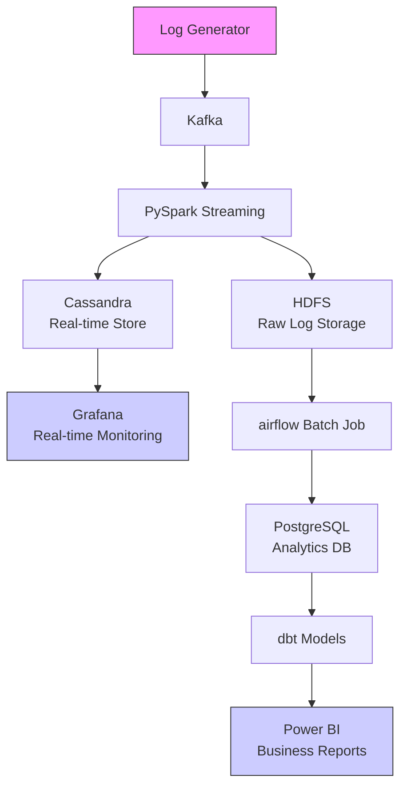
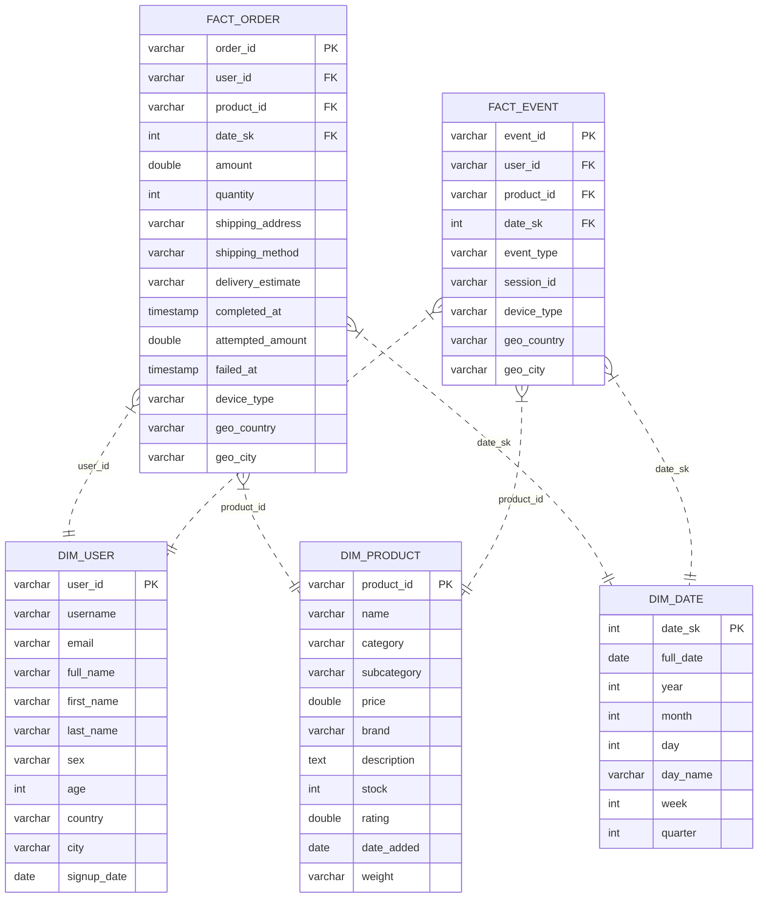

# End-to-End Log Processing System

## Overview

This project is an end-to-end big data pipeline for processing, storing, and analyzing e-commerce event logs. It leverages modern data engineering tools and technologies, including:

- **Kafka** for real-time event streaming
- **Spark Structured Streaming** for real-time data processing
- **HDFS** for distributed storage
- **Cassandra** for scalable NoSQL storage and analytics
- **PostgreSQL** for analytics-ready storage
- **dbt** for data transformation and modeling
- **Airflow** for workflow orchestration (including batch jobs)
- **Docker Compose** for easy multi-service orchestration
- **Power BI** for business intelligence and visualization

## Architecture Diagram



## Directory Structure

```
Scripts/
  produser/
    Producer.py      # Kafka producer for log events
    logs.py          # Log generator logic
    users.json, products.json  # Sample data
  Consumer/
    Consumer.py      # Spark Structured Streaming consumer
cassandra_setup.cql  # Cassandra schema setup
setup_cassandra.sh   # Helper script to initialize Cassandra
docker-compose.yaml  # Multi-service orchestration
dockerfile           # Custom Docker build for Airflow
dags/                # Airflow DAGs for batch processing
  batch_hdfs_to_postgres.py  # Example DAG for batch ETL
  ...
dbt/                 # dbt project for transformations
```

## Prerequisites

- Docker & Docker Compose
- Python 3.8+ (for running scripts outside containers, if needed)
- Power BI Desktop (for analytics)

## Quick Start

### 1. Clone the Repository

```bash
git clone <repo-url>
cd end-to-end-log-processing
```

### 2. Start the System

```bash
docker-compose up -d
```

This will start all required services: Kafka, Zookeeper, Spark, HDFS (NameNode/DataNode), Cassandra, Airflow, PostgreSQL, and more.

### 3. Initialize Cassandra

After the containers are up, set up the Cassandra keyspace and table:

```bash
bash setup_cassandra.sh
```

This runs the schema in `cassandra_setup.cql` and verifies the setup.

### 4. Produce Log Events

In a new terminal, run the producer to generate and send events to Kafka:

```bash
docker exec -it spark bash
cd /opt/spark/scripts/produser
python3 Producer.py
```

### 5. Start the Consumer

In another terminal, run the Spark consumer to process and store the events:

```bash
docker exec -it spark bash
cd /opt/spark/scripts/Consumer
python3 Consumer.py
```

### 6. Batch Processing: HDFS to PostgreSQL (Every 10 Minutes)

Airflow is configured to run a DAG every 10 minutes that:
```docker exec -it airflow-webserver airflow users create \
  --username airflow \
  --password airflow \
  --firstname Airflow \
  --lastname Admin \
  --role Admin \
  --email admin@example.com
```
- Reads new data from HDFS
- Loads it into PostgreSQL for analytics

You can find and customize the DAG in `dags/batch_hdfs_to_postgres.py`.

Airflow UI: [http://localhost:8082](http://localhost:8082)

### 7. Data Transformation with dbt

After data lands in PostgreSQL, dbt is used for data modeling and transformation. The dbt project is located in the `dbt/` directory.

To run dbt transformations (from within the Airflow or dbt container):

```bash
docker exec -it <airflow-or-dbt-container> bash
cd /opt/airflow/dbt
# Configure your dbt profile for PostgreSQL connection
# Then run:
dbt run
```

### 8. Analytics with Power BI

- Connect Power BI Desktop to the PostgreSQL database (host: `localhost`, port: `5432`, user: `airflow`, password: `airflow`, db: `airflow`).
- Build dashboards and reports on top of the dbt models.

### 9. Accessing the Services

- **Spark UI**: [http://localhost:8080](http://localhost:8080)
- **HDFS NameNode UI**: [http://localhost:9870](http://localhost:9870)
- **Cassandra**: Port 9042 (use `cqlsh` or a GUI client)
- **PostgreSQL**: Port 5432 (use `psql` or a GUI client)
- **Kafka**: Port 9092 (internal), 29092 (external)
- **Airflow UI**: [http://localhost:8082](http://localhost:8082)


## DWH model 


## Data Flow

1. **Producer** generates logs and sends them to Kafka topic `LogEvents`.
2. **Consumer** reads from Kafka, parses and flattens the data, writes raw logs to HDFS and processed logs to Cassandra.
3. **Airflow** runs a batch job every 10 minutes to move new data from HDFS to PostgreSQL.
4. **dbt** transforms and models the data in PostgreSQL.
5. **Power BI** connects to PostgreSQL for analytics and visualization.
6. **Cassandra** table `logs.ecomm_log` is indexed for fast queries on event type, user, product, etc.

## Cassandra Table Schema

See `cassandra_setup.cql` for full schema. Main fields include:

- `timestamp`, `user_id`, `session_id`, `product_id`, `event_type`, `level`, `service`, etc.
- Flattened details for amounts, payment, shipping, errors, etc.

## Customization

- **Log Generation**: Edit `Scripts/produser/logs.py` to change event types, user/product pools, or log structure.
- **Consumer Logic**: Edit `Scripts/Consumer/Consumer.py` to change processing, filtering, or output logic.
- **Batch DAG**: Edit `dags/batch_hdfs_to_postgres.py` to customize the batch ETL logic.
- **dbt Models**: Edit the `dbt/` project for custom transformations.

## Stopping the System

```bash
docker-compose down
```

## Troubleshooting

- Ensure all containers are healthy (`docker ps`).
- Check logs for each service (`docker logs <container>`).
- If Cassandra or PostgreSQL is not ready, wait a minute before running the setup script.

## Extending with Grafana

To visualize Cassandra data in Grafana, see the instructions in the previous messages for connecting Grafana to Cassandra. 

## Extending with Power BI

- Use Power BI Desktop or Power BI Service to connect to the PostgreSQL database for advanced analytics and dashboarding.
- Recommended: Use the dbt models as your main reporting tables for clean, analytics-ready data. 
