# End-to-End Log Processing System

## Overview

This project is an end-to-end big data pipeline for processing, storing, and analyzing e-commerce event logs. It leverages modern data engineering tools and technologies, including:

- **Kafka** for real-time event streaming
- **Spark Structured Streaming** for real-time data processing
- **HDFS** for distributed storage
- **PostgreSQL** for analytics-ready storage
- **dbt** for data transformation and modeling
- **Airflow** for workflow orchestration (including batch jobs)
- **Docker Compose** for easy multi-service orchestration
- **Streamlit** for real-time monitoring and visualization
- **Power BI** for business intelligence and visualization

## Architecture Diagram

```mermaid
graph TD
    A[📊 Log Generator] --> B[🔄 Kafka]
    B --> C[⚡ Spark Structured Streaming]
    C --> F[🗄️ HDFS<br/>Raw Log Storage]
    F --> G[🛠️ Airflow Batch Job]
    G --> H[📊 PostgreSQL<br/>Analytics DB]
    H --> I[🔄 dbt Models]
    I --> J[📈 Power BI<br/>Business Reports]
    C --> E[📊 Streamlit<br/>Real-time Monitoring]
```



## Real-Time Monitoring Dashboard

Our system includes comprehensive real-time monitoring capabilities through Streamlit:


*Real-time events dashboard showing live event ingestion, filtering, and inspection*


*Geographic analysis dashboard visualizing user activity by location*


*Pipeline monitoring dashboard displaying system health, event flow, and error rates*

## Pipeline Work Completed

The Airflow DAG (`dags/spark_batch_job_dag.py`) orchestrating the batch processing pipeline from HDFS to PostgreSQL and dbt transformations has been enhanced with the following updates:
- **Task Organization**: Structured tasks into logical groups for clarity:
  - `check_services_group`: Verifies PostgreSQL and Spark availability (`check_services_health`).
  - `validate_and_processing_group`: Validates PostgreSQL data (`validate_postgres_data`) and runs Spark batch job (`spark_batch_task`).
  - `dbt_group`: Executes dbt snapshots (`dbt_snapshot_task`) and transformations (`dbt_run_task`).
  - Workflow: `check_services_group >> validate_and_processing_group >> dbt_group`.
- **Restored Workflow**: Reinstated the original sequence `spark_batch_task >> dbt_snapshot_task >> dbt_run_task` to align with pipeline requirements, processing HDFS data to PostgreSQL and applying dbt models.
- **Monitoring Enhancements**:
  - Added Slack notifications for DAG success/failure and individual task failures using `SlackWebhookOperator`.
  - Implemented email notifications for service downtime via `EmailOperator` (triggered on `check_services_health` failure).
- **Error Handling**: Configured retries (3 for `spark_batch_task`, 2 for others) with delays to ensure robustness.
- **Accomplishments**: Improved pipeline reliability, visibility, and maintainability, ensuring seamless data flow from HDFS to PostgreSQL with real-time monitoring and error alerts.

## Pipeline Monitoring with Streamlit

You can also monitor your pipeline using the interactive Streamlit dashboard, which provides:
- Real-time event ingestion and error rates
- Detailed log inspection and filtering
- Event type breakdowns and timelines
- Geographic and real-time event analysis

### To run the Streamlit dashboard:

```bash
pip install streamlit plotly pandas numpy
streamlit run streamlit_dashboard.py
```

- The dashboard will be available at [http://localhost:8501](http://localhost:8501) by default.
- Use this dashboard for operational monitoring and log inspection.

## Analytics & Statistics Dashboard

Advanced analytics and statistical insights are available through our dedicated analytics dashboard:


*Comprehensive analytics dashboard displaying key business metrics, user behavior patterns, and performance statistics*

## Data Flow Architecture


## Directory Structure

```
end-to-end-log-processing/
├── Scripts/
│   ├── produser/
│   │   ├── Producer.py          # Kafka producer for log events
│   │   ├── logs.py              # Log generator logic
│   │   ├── users.json           # Sample user data
│   │   └── products.json        # Sample product data
│   ├── Consumer/
│   │   └── Consumer.py          # Spark Structured Streaming consumer
│   └── spark_jop/
│       └── batch_jop.py         # Batch processing job
├── Monitoring/
│   ├── EVENTMONITORING.png      # Event monitoring dashboard
│   ├── STATISTICS_ANALYTICS.png # Analytics dashboard
├── dags/                        # Airflow DAGs
├── dbt/                         # dbt project for transformations
├── docker-compose.yaml          # Multi-service orchestration
└── dockerfile                   # Custom Docker build for Airflow
```

## Codebase Index

### Top-Level Structure

- **Scripts/**
  - **produser/**
    - `Producer.py`: Kafka producer for log events
    - `logs.py`: Log generator logic
    - `users.json`, `products.json`: Sample data
  - **Consumer/**
    - `Consumer.py`: Spark Structured Streaming consumer (reads from Kafka, writes to HDFS)
  - **spark_jop/**
    - `batch_jop.py`: Spark batch job (reads from HDFS, writes to PostgreSQL)
- **dags/**
  - `batch_job_dag.py`: Airflow DAG for orchestrating batch Spark job and dbt runs
- **dbt/**
  - **Ecommerce_model/**: Main dbt project
    - `dbt_project.yml`: dbt project config
    - `models/`: dbt models
      - `staging/`: Staging models (STG_user.sql, STG_Event.sql, STG_orders.sql, STG_Products.sql)
      - `olap_model/`: OLAP models
        - `fact/`: Fact tables (Fact_order.sql, Fact_Event.sql)
        - `dimensions/`: Dimension tables (Dim_users.sql, Dim_product.sql, Dim_date.sql)
      - `source.yml`: Source table definitions
    - `snapshots/`: Snapshots (CDC_product.sql)
    - `seeds/`, `tests/`, `analyses/`, `macros/`, `dbt_packages/`, `logs/`: dbt project structure
    - `README.md`: dbt project readme
- **Monitoring/**
  - `streamlit_dashboard.py`: Streamlit dashboard for real-time monitoring
  - Dashboard images: EVENTMONITORING.png, STATISTICS_ANALYTICS.png, Real-time Events.png, Geographic Analysis.png, Pipeline Monitoring.png
- **docker-compose.yaml**: Multi-service orchestration
- **dockerfile**: Custom Docker build for Airflow
- **logs/**: Airflow and pipeline logs
- **hadoop/**: Hadoop binaries (if any)
- **plugins/**, **includes/**: Airflow plugins and includes

---

## dbt Lineage & Data Model

The dbt project models the analytics layer in PostgreSQL, transforming raw event data into business-ready fact and dimension tables. The lineage below shows the flow from raw sources to final models:


*dbt lineage graph: sources → staging → facts/dimensions → analytics*

- **Sources**: Raw tables loaded from Spark batch job (e.g., `order_complete_response`, `search_response`, etc.)
- **Staging Models**: Clean and standardize raw data (`STG_user`, `STG_Event`, `STG_orders`, `STG_Products`)
- **Snapshots**: Track slowly changing dimensions (e.g., `CDC_product`)
- **Fact Tables**: Event and order facts (`Fact_Event`, `Fact_order`)
- **Dimension Tables**: User, product, and date dimensions (`Dim_users`, `Dim_product`, `Dim_date`)

See `dbt/Ecommerce_model/models/` for full SQL logic and model details.

## Prerequisites

- Docker & Docker Compose
- Python 3.8+ (for running scripts outside containers, if needed)
- Power BI Desktop (for analytics)

## Quick Start

### 1. Clone the Repository

```bash
git clone https://github.com/MAHMOUDMAMDOH8/end-to-end-log-processing
cd end-to-end-log-processing
```

### 2. Start the System

```bash
docker-compose up -d
```

This will start all required services: Kafka, Zookeeper, Spark, HDFS (NameNode/DataNode), Airflow, PostgreSQL, Streamlit, and more.

### 3. Produce Log Events

In a new terminal, run the producer to generate and send events to Kafka:

```bash
docker exec -it spark bash
cd /opt/spark/scripts/produser
python3 Producer.py
```

### 4. Start the Consumer

In another terminal, run the Spark consumer to process and store the events:

```bash
docker exec -it spark bash
cd /opt/spark/scripts/Consumer
python3 Consumer.py
```

### 5. Monitor Real-Time Data

Access the Streamlit dashboard for real-time, interactive, log-focused monitoring:

**Streamlit UI**: [http://localhost:8501](http://localhost:8501)

### 6. Batch Processing: HDFS to PostgreSQL (Every 10 Minutes)

Airflow is configured to run a DAG every 10 minutes that:
- Reads new data from HDFS
- Loads it into PostgreSQL for analytics

You can find and customize the DAG in `dags/spark_batch_job_dag.py`.

**Airflow UI**: [http://localhost:8082](http://localhost:8082)
- Username: `airflow`
- Password: `airflow`

### 7. Data Transformation with dbt

After data lands in PostgreSQL, dbt is used for data modeling and transformation. The dbt project is located in the `dbt/` directory.

To run dbt transformations:

```bash
docker exec -it <airflow-or-dbt-container> bash
cd /opt/airflow/dbt
# Configure your dbt profile for PostgreSQL connection
# Then run:
dbt run
```

### 8. Analytics with Power BI

- Connect Power BI Desktop to the PostgreSQL database (host: `localhost`, port: `5432`, user: `airflow`, password: `airflow`, db: `airflow`).
- Build dashboards and reports on top of the dbt models.

### 9. Accessing the Services

| Service | URL | Credentials |
|---------|-----|-------------|
| **Spark UI** | [http://localhost:8080](http://localhost:8080) | - |
| **HDFS NameNode UI** | [http://localhost:9870](http://localhost:9870) | - |
| **Streamlit** | [http://localhost:8501](http://localhost:8501) | - |
| **Airflow UI** | [http://localhost:8082](http://localhost:8082) | airflow/airflow |
| **PostgreSQL** | Port 5432 | airflow/airflow |
| **Kafka** | Port 9092 (internal), 29092 (external) | - |

## Data Flow

1. **📊 Producer** generates logs and sends them to Kafka topic `LogEvents`.
2. **⚡ Consumer** reads from Kafka, parses and flattens the data, writes raw logs to HDFS.
3. **📈 Streamlit** provides real-time monitoring and visualization of the streaming data.
4. **🛠️ Airflow** runs a batch job every 10 minutes to move new data from HDFS to PostgreSQL.
5. **🔄 dbt** transforms and models the data in PostgreSQL.
6. **📊 Power BI** connects to PostgreSQL for analytics and visualization.

## Monitoring & Analytics Features

### Real-Time Monitoring
- **Event Count Tracking**: Monitor events by type, user, and geographic location
- **Performance Metrics**: Track processing latency and throughput
- **Error Monitoring**: Real-time alerting for system issues
- **Geographic Visualization**: World map showing user activity by country

### Statistical Analytics
- **User Behavior Analysis**: Session duration, product interactions
- **Revenue Tracking**: Purchase amounts, payment methods
- **Search Analytics**: Query patterns, result counts
- **Error Analysis**: Error codes, failure rates

### Dashboard Features
- **Real-time Updates**: Live data refresh every few seconds
- **Interactive Filters**: Drill-down capabilities by time, region, event type
- **Customizable Alerts**: Configure thresholds for automated notifications
- **Export Capabilities**: Download reports and data for further analysis

## Database Schemas (Mermaid)

### Analytics (dbt/PostgreSQL): Fact & Dimension Tables


## Customization

- **Log Generation**: Edit `Scripts/produser/logs.py` to change event types, user/product pools, or log structure.
- **Consumer Logic**: Edit `Scripts/Consumer/Consumer.py` to change processing, filtering, or output logic.
- **Batch DAG**: Edit `dags/spark_batch_job_dag.py` to customize the batch ETL logic.
- **dbt Models**: Edit the `dbt/` project for custom transformations.

## Stopping the System

```bash
docker-compose down
```

## Troubleshooting

- Ensure all containers are healthy (`docker ps`).
- Check logs for each service (`docker logs <container>`).
- If PostgreSQL is not ready, wait a minute before running the setup script.

## Performance Optimization

- **Kafka**: Adjust partition count and replication factor based on throughput requirements
- **Spark**: Configure executor memory and cores based on data volume
- **PostgreSQL**: Configure connection pooling and query optimization

## Security Considerations

- Change default passwords in production
- Use SSL/TLS for database connections
- Implement proper network segmentation
- Regular security updates for all components

## Contributing

1. Fork the repository
2. Create a feature branch
3. Make your changes
4. Add tests if applicable
5. Submit a pull request

## License

This project is licensed under the MIT License - see the [LICENSE](LICENSE) file for details. 
